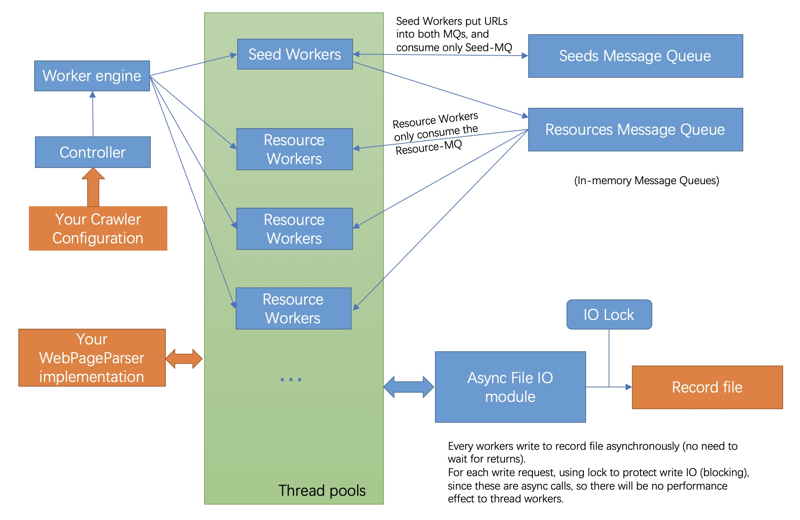

# web-crawler-plus
web-crawler-plus (WCP) is a lightweight multi-thread web crawler framework.  
You can build your own web crawler with little Java coding using this framework. 
The web crawler can be used on text/picture/music/... auto-crawling.  

WCP uses asynchronously write to document all records which were crawled before. This feature makes sure no duplicated Urls are searched.
  
Demo is in the package pers.perry.xu.crawler.framework.webcrawler.demo

## Quick start
```
# 1. implement the WebPageParser interface, e.g.
public class YourPageParser implements WebPageParser {
    @Override
	public List<String> getSeedUrlsList(WebPage webPage) {
        // go through the webPage and returns the sub-seed Urls list.
    }
    @Override
	public List<WebMedia> getMediaDataList(WebPage webPage) {
        // go through the webPage and returns the media data (support: JPG/PNG/GIF/BMP/MP3/MP4/FLV) resoruce list from the page.
        // return null if you don't want any media data
    }
    @Override
	public String getText(WebPage webPage) {
        // go through the webPage and returns the text content from the page.
        // return null if you don't want any text
    }
}

# 2. build your configuration (workspace path, thread number, seeds, etc.)
CrawlerConfiguration configuration = new CrawlerConfiguration();
configuration.addSeed("https://abcdefg");
configuration.addSeed("hhttps://hijklmn");
...
configuration.setMaxThreadNumber(3); // 1 seed worker + 2 resource workers
configuration.setWorkSpace("/Users/perry/Documents/testprogram/webcrawler/"); // output or record files path
configuration.setParser(new YourPageParser());
configuration.setOutputMode(DataOutputMode.DownloadToFiles);

# 3. start crawler
CrawlerController controller = new CrawlerController(configuration);
controller.startCrawler();

```
PS: the default seed workers : resource workers = 1:4
if less than 5 threads, then there will be only 1 seed worker.
## Architecture Graph for WCP: 


## Copyright:  
Perry Xu  
xupubit@163.com
